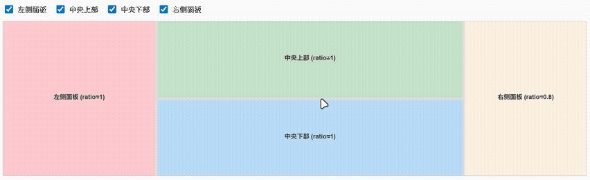

# vue-resizable

A Vue 3 component library for creating resizable areas. Supports flexible combinations and custom styles.



## Installation

```bash
npm install @hllshiro/vue-resizable
```

**Note**: This library requires Vue 3 as a peer dependency. Make sure you have Vue 3 installed in your project:

```bash
npm install vue@^3.0.0
```

## Vue Version Compatibility

- Vue 3.0.0 and above
- Built with TypeScript for better development experience
- Supports both JavaScript and TypeScript projects

## Usage

### Global Registration

Register all components globally in your main application file:

```javascript
// main.ts
import { createApp } from 'vue'
import VueResizable from '@hllshiro/vue-resizable'
import '@hllshiro/vue-resizable/style.css'

const app = createApp(App)
app.use(VueResizable)
app.mount('#app')
```

### Local Registration (Recommended)

Import and use components locally for better tree-shaking:

```javascript
// Component.vue
<script setup>
import { ResizableContainer, ResizablePanel, ResizableSplitter } from '@hllshiro/vue-resizable'
import '@hllshiro/vue-resizable/style.css'
</script>
```

### TypeScript Support

This library is built with TypeScript and provides full type definitions. No additional `@types` packages are needed.

```typescript
// Component.vue
<script setup lang="ts">
import { ResizableContainer, ResizablePanel, ResizableSplitter } from '@hllshiro/vue-resizable'
import type { Component } from 'vue'
import '@hllshiro/vue-resizable/style.css'

// Components are fully typed
const container: Component = ResizableContainer
</script>
```
## Example

### Basic Usage

```vue
<template>
  <!-- Horizontal layout -->
  <ResizableContainer direction="horizontal" style="height: 100vh">
    <ResizablePanel style="min-width: 150px; background: #ffe0b2">
      Left Panel
    </ResizablePanel>
    <ResizableSplitter />
    <ResizablePanel :style="middleStyle">
      <!-- Nested vertical layout -->
      <ResizableContainer direction="vertical">
        <ResizablePanel style="min-height: 150px">Top</ResizablePanel>
        <ResizableSplitter style="background: #000" />
        <ResizablePanel style="height: 200px; min-height: 150px">Center</ResizablePanel>
        <ResizableSplitter />
        <ResizablePanel style="height: 300px; min-height: 50px; border: 1px solid #ccc">
          Bottom
        </ResizablePanel>
      </ResizableContainer>
    </ResizablePanel>
    <ResizableSplitter />
    <ResizablePanel :style="rightStyle">Right Panel</ResizablePanel>
  </ResizableContainer>
</template>

<script setup>
import { ResizableContainer, ResizablePanel, ResizableSplitter } from '@hllshiro/vue-resizable'
import '@hllshiro/vue-resizable/style.css'

const rightStyle = {
  width: '500px',
  minWidth: '150px',
  border: '1px solid #ccc'
}

const middleStyle = {
  width: '500px',
  minWidth: '150px',
  border: '1px solid #ccc',
  display: 'flex',
  flexDirection: 'column',
  height: '100%',
  overflow: 'hidden'
}
</script>
```

### TypeScript Example

```vue
<template>
  <ResizableContainer direction="horizontal" style="height: 100vh">
    <ResizablePanel style="min-width: 200px">
      Content 1
    </ResizablePanel>
    <ResizableSplitter />
    <ResizablePanel style="min-width: 200px">
      Content 2
    </ResizablePanel>
  </ResizableContainer>
</template>

<script setup lang="ts">
import { ResizableContainer, ResizablePanel, ResizableSplitter } from '@hllshiro/vue-resizable'
import '@hllshiro/vue-resizable/style.css'

// TypeScript will provide full intellisense and type checking
</script>
```

## API

### ResizableContainer

Props:
- `direction`: `'horizontal' | 'vertical'` - Layout direction

### ResizablePanel

A flexible panel that can be resized. Use CSS `min-width`, `min-height`, `width`, and `height` properties to control sizing constraints.

### ResizableSplitter

A draggable splitter that allows users to resize adjacent panels.

## Development

This library is built with:
- Vue 3
- TypeScript
- Vite
- Modern ES modules

## License

MIT