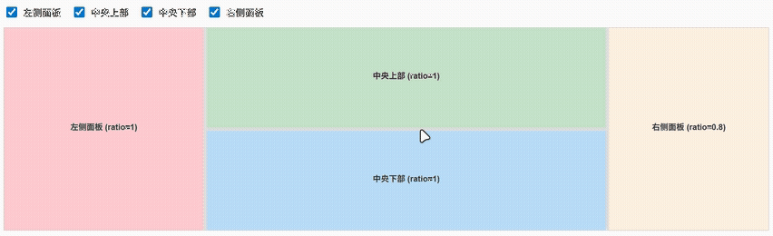

[English](./README.md) | 简体中文

# vue-resizable

一个用于创建可调整大小区域的 Vue 3 组件库。支持灵活的组合和自定义样式。



## 特性

- 🎯 **直观的拖拽行为**: 拖拽分割器时，仅影响相邻的两个面板。
- 🚀 **高精度**: 在拖拽操作中实现了基于增量的“零和”计算。此方法从根本上防止了浮点数的累积误差，使尺寸调整完全稳定和精确。
- 🔧 **按比例初始化**: 使用 `ratio` 属性来定义面板的初始比例尺寸。
- 📱 **响应式**: 自动适应容器尺寸的变化。
- 🎨 **可定制**: 通过 CSS (`min-width`/`min-height`) 完全控制面板的尺寸和约束。
- 💪 **TypeScript**: 提供开箱即用的完整类型安全。
- 🪶 **轻量级**: 最小的打包体积，无任何依赖。
- 👁️ **动态可见性**: 支持显示/隐藏面板，并自动调整布局。

## 架构

该库使用现代 Flexbox 架构，其中面板尺寸由 `flex-basis` 控制。

- **使用比例进行初始尺寸设定**: `ratio` 属性用于确定面板间的初始空间分配。加载时，容器会根据所有可见面板的 `ratio` 总和为每个面板计算出合适的 `flex-basis` 百分比。初始化之后，面板的尺寸由用户拖拽决定。
- **严格的尺寸控制**: 面板被配置为 `flex-grow: 0` 和 `flex-shrink: 0`。这确保了 `flex-basis` 的百分比被严格遵守，防止了浏览器默认 Flexbox 行为带来的不可预测的尺寸调整。
- **稳定的拖拽机制**: 当拖拽操作开始时，所有面板尺寸会临时转换为稳定的、基于百分比的 `flex-basis`。然后，拖拽操作会应用计算出的像素增量，确保一个面板增加的尺寸精确等于相邻面板减少的尺寸，从而保证总尺寸恒定，并消除布局偏移或舍入误差。

## 安装

```bash
npm install @hllshiro/vue-resizable
```

**注意**: 此库需要 Vue 3 作为对等依赖项。请确保你的项目中已安装 Vue 3：

```bash
npm install vue@^3.0.0
```

## Vue 版本兼容性

- Vue 3.0.0 及以上版本
- 使用 TypeScript 构建，提供更好的开发体验
- 支持 JavaScript 和 TypeScript 项目

## 使用方法

### 全局注册

在你的主应用文件中全局注册所有组件：

```javascript
// main.ts
import { createApp } from 'vue'
import VueResizable from '@hllshiro/vue-resizable'
import '@hllshiro/vue-resizable/style.css'

const app = createApp(App)
app.use(VueResizable)
app.mount('#app')
```

### 局部注册 (推荐)

为获得更好的摇树优化（tree-shaking），请在组件内局部导入和使用：

```javascript
// Component.vue
<script setup>
import { ResizableContainer, ResizablePanel, ResizableSplitter } from '@hllshiro/vue-resizable'
import '@hllshiro/vue-resizable/style.css'
</script>
```

### TypeScript 支持

此库使用 TypeScript 构建，并提供完整的类型定义。无需安装额外的 `@types` 包。

```typescript
// Component.vue
<script setup lang="ts">
import { ResizableContainer, ResizablePanel, ResizableSplitter } from '@hllshiro/vue-resizable'
import type { Component } from 'vue'
import '@hllshiro/vue-resizable/style.css'

// 组件是完全类型化的
const container: Component = ResizableContainer
</script>
```
## API

### ResizableContainer

管理面板和分割器布局的主容器组件。

**Props:**
- `direction`: `'horizontal' | 'vertical'` - 布局方向

**特性:**
- 根据内联样式自动初始化面板尺寸
- 将像素值转换为合适的 flex 属性
- 处理容器尺寸变化事件

### ResizablePanel

一个可由相邻分割器调整大小的弹性面板。

**Props:**
- `show`: `boolean` (默认: `true`) - 控制面板的可见性
- `ratio`: `number` (默认: `1`) - 用于按比例调整尺寸的面板比例值

**尺寸调整行为:**
- **基于比例的尺寸**: 使用 `ratio` 属性来控制面板的比例
  - 更高的 `ratio` 值会获得更多的空间分配
  - 所有面板的 `ratio` 会按比例计算
**尺寸调整行为:**
- **基于比例的初始尺寸**: 使用 `ratio` 属性来设定面板相对于其他面板的初始大小。
  - 在初始化时，更高的 `ratio` 值会获得更多的空间分配。
- **动态可见性**: 使用 `show` 属性来隐藏/显示面板，布局会自动重新计算。

**CSS 属性:**
- `min-width`, `min-height`: 最小尺寸约束
- `max-width`, `max-height`: 最大尺寸约束 (可选)

### ResizableSplitter

一个可拖动的分隔条，允许用户调整相邻面板的大小。

**行为:**
- 只影响紧邻的两个面板
- **精确计算**: 在拖拽过程中采用基于增量的“零和”算法。这意味着一个面板获得的尺寸精确等于另一个面板失去的尺寸，从而消除了累积的舍入误差，确保了极其平滑和稳定的尺寸调整。
- **智能可见性**: 当相邻的面板被隐藏时，分割器会自动隐藏

**样式:**
- 默认尺寸: 5px 宽度/高度
- 包含悬停和激活状态的样式
- 可通过 CSS 完全自定义

## 贡献

欢迎贡献！请确保：
- TypeScript 类型得到妥善维护
- 更改遵循基于 Flexbox 的架构

## 许可证

MIT
